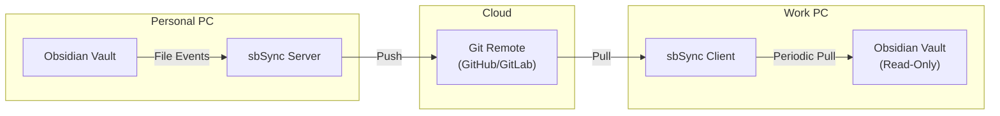

# sbSync

Automated bidirectional Git synchronization suite for Obsidian Vault between personal and work environments.

## Overview

sbSync is a complete solution for keeping your Obsidian Vault synchronized across multiple machines via Git:

- **sbSync Server**: Watches for local changes on your personal PC and automatically pushes to remote
- **sbSync Client**: Periodically pulls changes from remote to your work PC (read-only)

```
Personal PC (Server)  →  GitHub/GitLab  →  Work PC (Client)
   [Edit & Push]            [Remote]         [Pull & Read]
```

## Components

### 🚀 Server (Push Client)
Located in `server/`, monitors your personal PC's Obsidian Vault and automatically commits/pushes changes.

**Features:**
- File system watching with `watchdog`
- Debounced commits (configurable interval)
- Automatic push to remote
- Prometheus metrics on port 8000

**Use Case:** Personal PC where you actively edit your Obsidian Vault

### 📥 Client (Pull Client)
Located in `client/`, periodically pulls changes from remote and discards any local modifications.

**Features:**
- Scheduled periodic pulls
- Always clean working directory (`git clean && git checkout`)
- Read-only synchronization
- Prometheus metrics on port 8001

**Use Case:** Work PC where you need read-only access to your vault

## Quick Start

### Option 1: Run Both Services (Testing/Development)

If you want to run both server and client on the same machine:

```bash
# 1. Configure environment
cp .env.example .env
# Edit .env with your settings

# 2. Run both services
docker-compose up -d --build

# 3. Check status
docker-compose ps
docker-compose logs -f sbsync-server
docker-compose logs -f sbsync-client
```

### Option 2: Run Server Only (Personal PC)

```bash
docker-compose up -d --build sbsync-server
```

### Option 3: Run Client Only (Work PC)

```bash
docker-compose up -d --build sbsync-client
```

## Configuration

Edit `.env` file with your settings:

```bash
# Shared Configuration
GIT_REMOTE_URL=git@github.com:username/obsidian-vault.git
SSH_KEY_HOST_PATH=/Users/username/.ssh/id_ed25519

# Server (Personal PC)
SERVER_TARGET_DIR=/path/to/your/vault
SERVER_METRICS_PORT=8000
SERVER_DEBOUNCE_SECONDS=300

# Client (Work PC)
CLIENT_TARGET_DIR=/path/to/vault/clone
CLIENT_METRICS_PORT=8001
CLIENT_PULL_INTERVAL_MINUTES=5
```

## Documentation

### Server Documentation
- [Server Specification](server/md/spec.md)
- [Server Architecture](server/md/architecture.md)
- [Server Usage Guide](server/md/usage.md)

### Client Documentation
- [Client Specification](client/md/spec.md)
- [Client Architecture](client/md/architecture.md)
- [Client Usage Guide](client/md/usage.md)

## Monitoring

Both services expose Prometheus metrics:

- **Server**: `http://localhost:8000/`
  - `sbsync_commits_total`
  - `sbsync_pushes_total`
  - `sbsync_last_sync_timestamp`

- **Client**: `http://localhost:8001/`
  - `sbsync_client_pulls_total`
  - `sbsync_client_errors_total`
  - `sbsync_client_last_pull_timestamp`

## Architecture



## Development

### Prerequisites
- Python 3.11+
- uv (Package Manager)
- Git
- Docker (for containerized deployment)

### Local Development

#### Server
```bash
cd server
uv sync
uv run sbsync
```

#### Client
```bash
cd client
uv sync
uv run sbsync-client
```

## Use Cases

### Scenario 1: Personal ↔ Work Sync
- **Personal PC**: Run server to push your changes
- **Work PC**: Run client to pull changes (read-only)
- Changes made at work are discarded on next pull

### Scenario 2: Multiple Personal Devices
- **Main Device**: Run server
- **Other Devices**: Run client for read-only access
- Or run server on all devices (requires conflict resolution)

### Scenario 3: Backup & Archive
- **Main Device**: Run server to continuously backup
- **Archive Device**: Run client to maintain a read-only copy

## Important Notes

### Server Behavior
- Monitors file system for changes
- Creates timestamped commits
- Pushes to remote automatically
- Respects `.gitignore` in your vault

### Client Behavior
- **Always discards local changes**
- Runs `git clean -fd && git checkout .` before pull
- Work PC modifications will be lost
- Ensures consistency with remote

## Troubleshooting

### Server Issues
- Check if TARGET_DIR is correctly mounted
- Verify SSH key permissions (should be 600)
- Check metrics at http://localhost:8000

### Client Issues
- Verify GIT_REMOTE_URL is set
- Check SSH authentication
- Check metrics at http://localhost:8001

### Docker Issues
```bash
# View logs
docker-compose logs sbsync-server
docker-compose logs sbsync-client

# Restart services
docker-compose restart

# Rebuild
docker-compose up -d --build
```

## Requirements

- Python 3.11+
- Git
- Docker (recommended)
- SSH key for Git authentication

## License

MIT License - See LICENSE file for details

## Technical Stack

- **Language**: Python 3.11+
- **Package Manager**: uv (Astral)
- **Git Operations**: GitPython
- **File Watching**: watchdog (server only)
- **Scheduling**: schedule (client only)
- **Metrics**: prometheus_client
- **Container**: Docker with docker-compose
