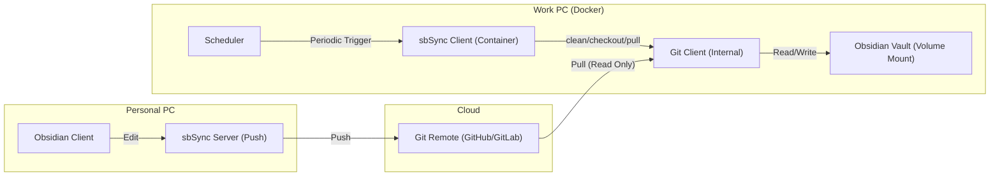

# System Architecture - Client (Pull Client)

## 1. Overview
sbSync Client automates the read-only synchronization of an Obsidian Vault from a Git Remote to a work environment, discarding any local changes.

This is the **client** component of the sbsync suite. See the [server component](../../server/md/architecture.md) for the push client used on personal PCs.

## 2. Component Diagram

## 3. Core Components

### 3.1 sbSync Client (Python)
- **Scheduler**: Triggers periodic pull operations using `schedule` library.
- **Git Handler**: Executes `git clean -fd`, `git checkout .`, `git pull` using `GitPython`.
- **Startup Initial Sync**: On process start, performs initial pull to get latest state.
- **Metrics**: Exposes Prometheus metrics on port 8001.

### 3.2 Data Flow
- **Personal PC → Remote**: sbSync pushes changes.
- **Remote → Work PC**: sbSync Client pulls changes (read-only).
- Local changes on Work PC are always discarded.

### 3.3 Security
- **Credentials**: Git credentials and SSH keys are injected via environment variables or volume mounts.
- No sensitive data is stored in the Docker image.
- SSH keys are handled with proper permissions (0600).

## 4. Comparison with sbSync Server

| Feature | sbSync Server | sbSync Client |
|---------|---------------|---------------|
| Direction | Personal PC → Remote | Remote → Work PC |
| Operation | Watch + Commit + Push | Scheduled Pull |
| Local Changes | Preserved and committed | Discarded (clean/checkout) |
| Use Case | Content creation | Read-only consumption |
| Location | `server/` directory | `client/` directory |
