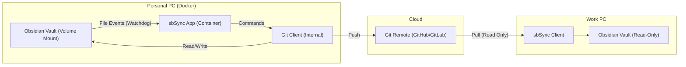

# System Architecture - Server (Push Client)

## 1. Overview
sbSync Server automates the synchronization of an Obsidian Vault from a personal PC to a Git Remote by watching for file changes and automatically pushing them.

This is the **server** component of the sbsync suite. See the [client component](../../client/md/architecture.md) for the read-only pull client used on work PCs.

## 2. Component Diagram

## 3. Core Components

### 3.1 sbSync Server (Python)
- **Watcher**: Monitors file system events using `watchdog`.
- **Debouncer**: Aggregates rapid changes to prevent excessive commits (default 5 min).
- **Git Handler**: Executes `git add`, `commit`, `push` using `GitPython`.
- **Startup Initial Sync**: On process start, sbSync attempts a best-effort initial sync (e.g., `pull --rebase` when safe) before starting the watcher loop.
- **Metrics**: Exposes Prometheus metrics on port 8000.

### 3.2 Data Separation
- **Code**: Maintained in the `sbsync` repository.
- **Data**: The Obsidian Vault is mounted as a volume at runtime. The app logic is decoupled from the content.

### 3.3 Security
- **Credentials**: Git credentials and SSH keys are injected via environment variables or volume mounts.
- No sensitive data is stored in the Docker image.
